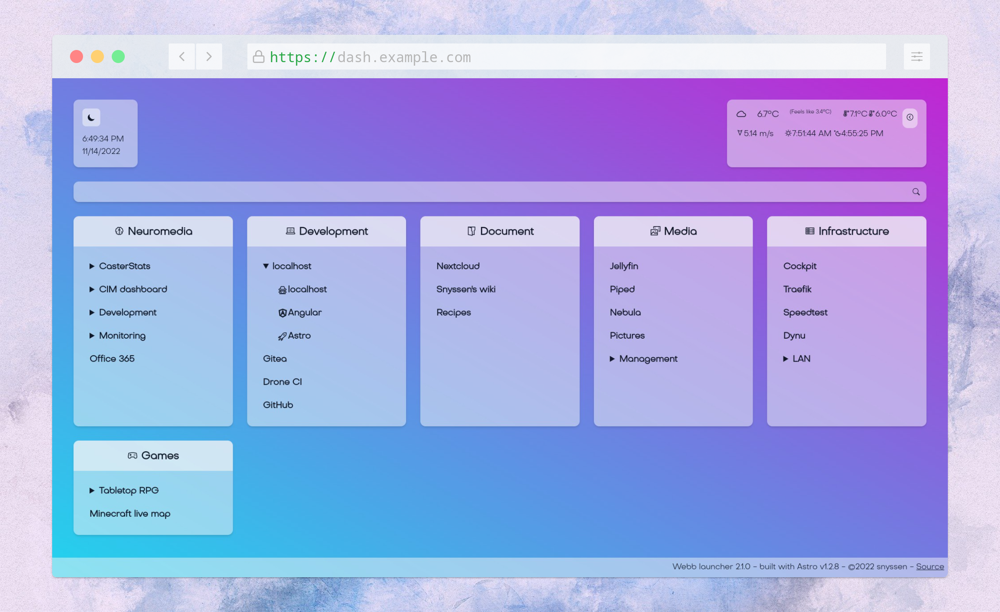
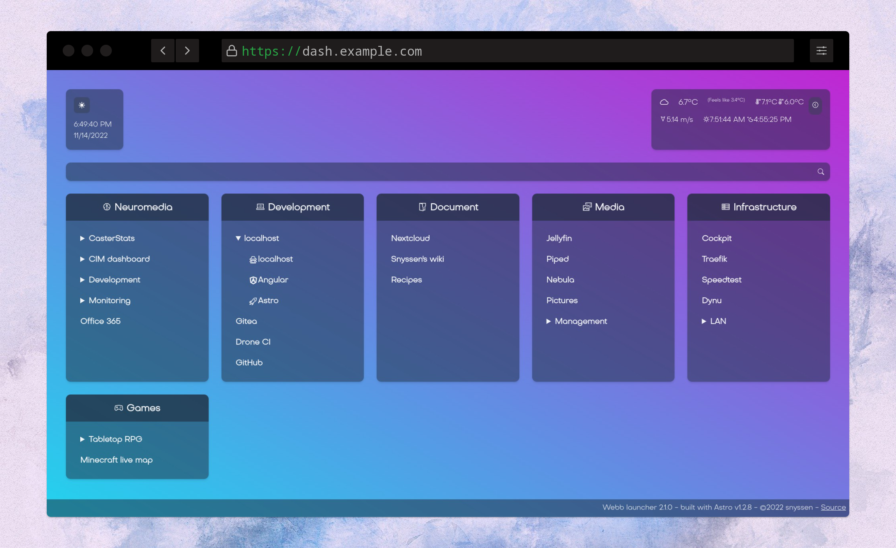
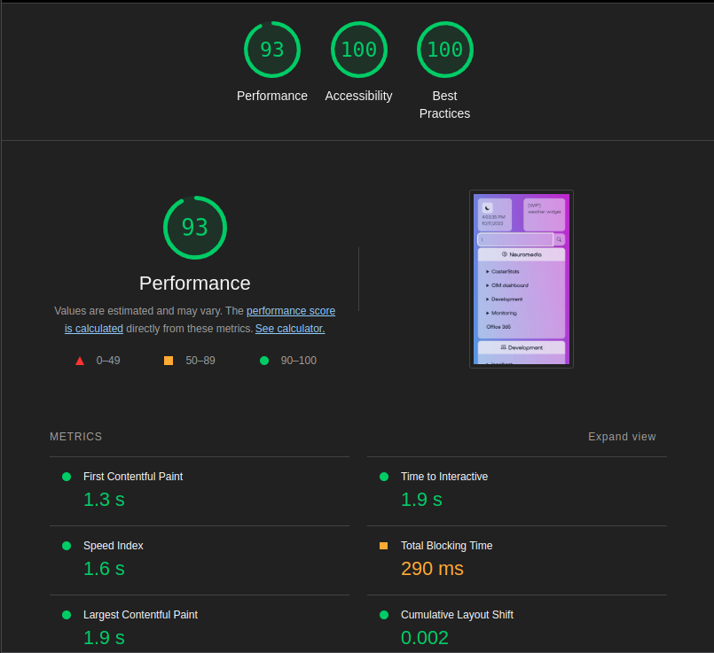

# Webb Launcher

[](https://drone.snyssen.be/snyssen/webb-launcher) [](https://git.snyssen.be/snyssen/-/packages/container/webb-launcher/latest)

|  |  |
| ------------------------------------------------ | ---------------------------------------------- |

Webb Launcher is a minimalist starting page/personal dashboard mainly aimed at self-hosters. With its [(almost) perfect lighthouse score](#lighthouse-results) and its mobile-first responsive design, it will load fast and look great on any of your devices.

Built with [Astro](https://astro.build), Webb Launcher is an homage to the [James Webb space telescope](https://en.wikipedia.org/wiki/James_Webb_Space_Telescope) and its [Ariane 5](https://en.wikipedia.org/wiki/Ariane_5) launcher.

> **NOTE:** The GitHub repository is a mirror of the original repository, where the actual development work is done.

## How to use

The recommended approach is with docker-compose and an accompanying .env file for your list of shortcuts:

> `docker-compose.yml` file

```yml
version: "3.3"
services:
  dashboard:
    image: git.snyssen.be/snyssen/webb-launcher:1
    env_file:
      - ./.env
    ports:
      - 80:80
```

> `.env` file

```bash
SHORTCUTS="
- name: Development
  icon_classes: las la-laptop-code
  children:
    - name: localhost
      children:
        - name: localhost
          icon_classes: las la-user-secret
          url: http://localhost
        - name: Angular
          icon_classes: lab la-angular
          url: http://localhost:4200
        - name: Astro
          icon_classes: las la-rocket
          url: http://localhost:3000
    - name: Gitea
      url: https://git.snyssen.be
    - name: Drone CI
      url: https://drone.snyssen.be
    - name: GitHub
      url: https://github.com
- name: Social
  icon_classes: las la-user-friends
  children:
    - name: Mastodon
      url: https://joinmastodon.org
    - name: Odysee
      url: https://odysee.com
    - name: Matrix
      url: https://matrix.org
"
```

As you can see, the launcher expects a list of shortcuts in the form of a yaml tree. The tree has a minimum depth of 2 and a maximum depth of 3. Nodes are composed of the following fields:

| Field name     | Field value                                                                                                     | Required                                          |
| -------------- | --------------------------------------------------------------------------------------------------------------- | ------------------------------------------------- |
| `name`         | The display name for the corresponding element                                                                  | **yes**                                           |
| `icon_classes` | Classes to apply to an `<i/>` element in order to display [Line Awesome](https://icons8.com/line-awesome) icons | no                                                |
| `url`          | An url to link to                                                                                               | Only at depth 2 and 3                             |
| `children`     | List of children for the current node                                                                           | Only at depth 1, should not be present at depth 3 |

Each depth corresponds to a different element in the dashboard:

| Depth | Impacted element  | Expected fields (bold if required, impact in parenthesis)                                                                                                                            |
| ----- | ----------------- | ------------------------------------------------------------------------------------------------------------------------------------------------------------------------------------ |
| 1     | card              | **name** (title), icon_classes (icon before text), children (body of card)                                                                                                           |
| 2     | body of card      | **name** (text of the link or accordion), icon_classes (icon before text if link, or after text if accordion), children (body of accordion; *if unset, current node will be a link*) |
| 3     | body of accordion | **name** (text of the link), icon_classes (icon before text)                                                                                                                         |

## Lighthouse results

### Desktop


### Mobile


